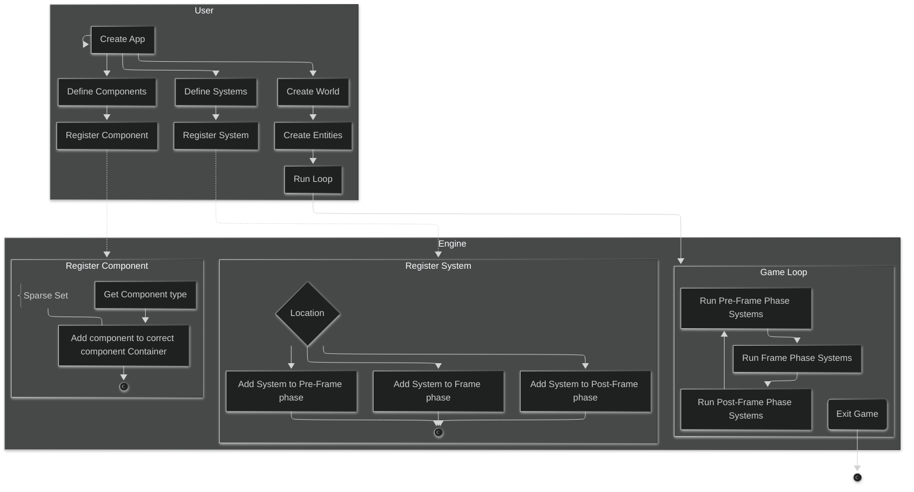

# Requisites
- Easy to create new entities with components
- Easy to add new systems

## Flowcharts

```mermaid
---
config:
  theme: dark
  look: neo
  layout: elk
---
flowchart TD
 subgraph User["User"]
        createApp["Create App"]
        defComps["Define Components"]
        defSys["Define Systems"]
        createApp["Create App"]
        createWorld["Create World"]
        createEnts["Create Entities"]
        runLoop["Run Loop"]
        regComp["Register Component"]
        regSys["Register System"]
  end
 subgraph regComponentSub["Register Component"]
        getCompType["Get Component type"]
        addCompCont["Add component to correct component Container"]
        regCompStop["regCompStop"]
        n25["Sparse Set"]
  end
 subgraph Engine["Engine"]
        regComponentSub
        regSysSub["regSysSub"]
        gameLoop["gameLoop"]
  end
 subgraph regSysSub["Register System"]
        regSysDec["Location"]
        addSysPreFrame["Add System to Pre-Frame phase"]
        addSysFrame["Add System to Frame phase"]
        addSysPostFrame["Add System to Post-Frame phase"]
        stopSysReg["stopSysReg"]
  end
 subgraph gameLoop["Game Loop"]
        preFrame["Run Pre-Frame Phase Systems"]
        Frame["Run Frame Phase Systems"]
        postFrame["Run Post-Frame Phase Systems"]
        exitEvent["Exit Game"]
  end
    createApp --> defComps & defSys & createApp
    createApp --> createWorld
    createWorld --> createEnts
    createEnts --> runLoop
    defComps --> regComp
    defSys --> regSys
    regSys -.-> regSysSub
    regComp -.-> regComponentSub
    regSysDec --> addSysPreFrame & addSysFrame & addSysPostFrame
    addSysPostFrame --> stopSysReg
    addSysFrame --> stopSysReg
    addSysPreFrame --> stopSysReg
    getCompType --> addCompCont
    addCompCont --> regCompStop
    preFrame --> Frame
    Frame --> postFrame
    postFrame --> preFrame
    runLoop --> gameLoop
    exitEvent --> n24["Stop"]
    n25 --- addCompCont
    regCompStop@{ shape: stop}
    n25@{ shape: comment}
    regSysDec@{ shape: decision}
    stopSysReg@{ shape: stop}
    exitEvent@{ shape: event}
    n24@{ shape: stop}
```
