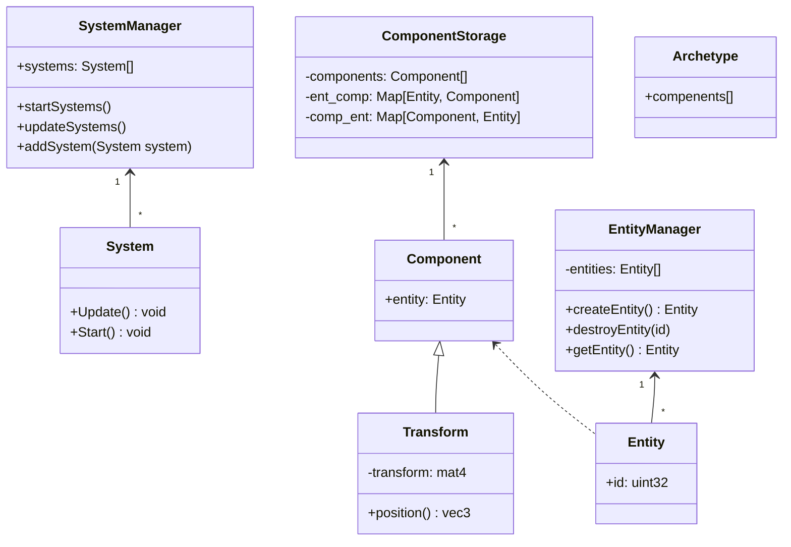

```mermaid
classDiagram
    class System {
	    +Update() void
	    +Start() void
    }
    class Transform {
	    -transform: mat4
	    +position() vec3
    }
    class ComponentStorage {
	    -components: Component[]
        -ent_comp: Map[Entity, Component]
        -comp_ent: Map[Component, Entity]
    }
    class SystemManager {
	    +systems: System[]
	    +startSystems()
	    +updateSystems()
        +addSystem(System system)
    }
    class Component {
	    +entity: Entity
    }
    class Entity {
	    +id: uint32
    }
    class EntityManager {
	    -entities: Entity[]
	    +createEntity() Entity
        +destroyEntity(id)
	    +getEntity() Entity
    }
    
    class Archetype{
        +compenents[]
}

    Component <|-- Transform
    EntityManager "1" <-- "*" Entity
    ComponentStorage "1" <-- "*" Component
    SystemManager "1" <-- "*" System
    Component <.. Entity
```
