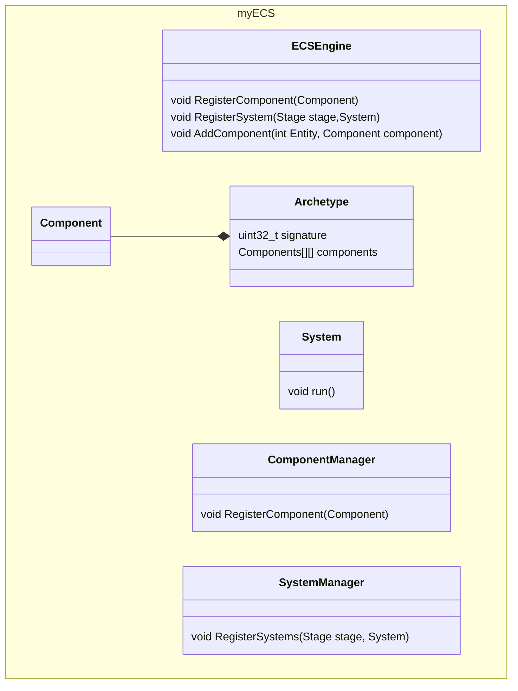

```mermaid
classDiagram
direction TB
	namespace myECS {
        class ECSEngine{
            void RegisterComponent(Component)
            void RegisterSystem(Stage stage,System)
            void AddComponent(int Entity, Component component)
        }
        class System {
            void run()
        }
        class Component {
        }
        class ComponentManager{
            void RegisterComponent(Component)
        }
        class SystemManager{
            void RegisterSystems(Stage stage, System)
        }
        class Archetype {
	        uint32_t signature
	        Components[][] components
        }
	}
    Component --* Archetype
```
